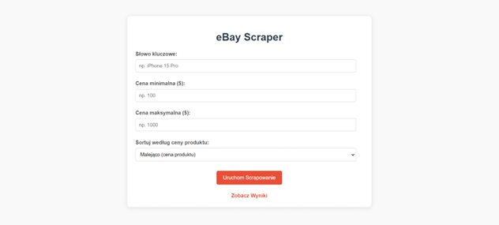
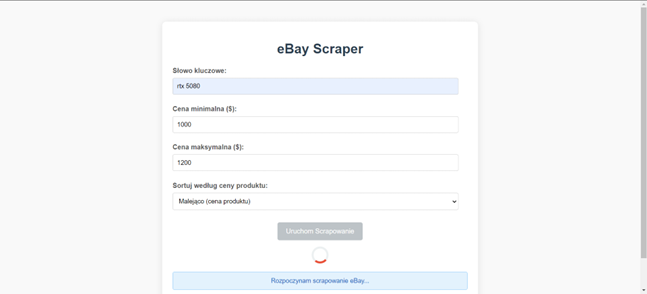
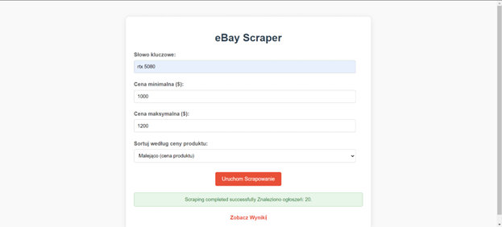
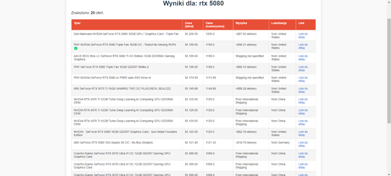
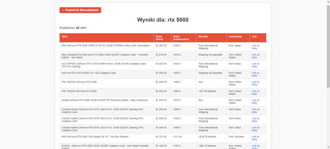

# Projekt semestralny PRIR

## 📌 Opis projektu

Aplikacja umożliwia scrapowanie danych o produktach z serwisu **eBay**, zgodnie z parametrami zadanymi przez użytkownika (nazwa produktu, przedział cenowy). System działa w architekturze rozproszonej – oparty na trzech modułach: interfejs użytkownika, silnik scrapujący oraz baza danych. Wszystkie komponenty działają w osobnych kontenerach Docker.

Projekt wykorzystuje:
- `Flask` – interfejs użytkownika
- `asyncio`, `aiohttp`, `multiprocessing` – silnik scrapujący
- `BeautifulSoup` – parsowanie treści HTML
- `MongoDB` – baza danych
- `Docker`, `docker-compose` – konteneryzacja

## 📂 Struktura projektu

```
Projekt_PRIR/
├── Dockerfile # Instrukcja budowy głównego kontenera aplikacji
├── docker-compose.yml # Definicje i konfiguracja wszystkich kontenerów, zarządzanie usługami
│
├── engine/ # Silnik scrapujący
│   ├── Dockerfile # Instrukcja budowy kontenera dla silnika scrapującego
│   ├── requirements.txt # Lista zależności Python dla silnika
│   ├── engine_api.py # API silnika
│   └── scraper.py # Główna logika scrapowania, przetwarzania danych i interakcji z API
│
└── flask_app/ # Interfejs użytkownika (Flask)
    ├── Dockerfile # Instrukcja budowy kontenera dla aplikacji Flask
    ├── requirements.txt # Lista zależności Python dla aplikacji Flask
    ├── app.py # Główna logika aplikacji Flask
    │
    ├── static/ # Katalog na pliki statyczne
    │   │
    │   └── css/ # Podkatalog na arkusze stylów CSS
    │       ├── style_index.css # Style CSS dla strony głównej (index.html)
    │       └── style_results.css # Style CSS dla strony wyników (results.html)
    │
    └── templates/ # Katalog na szablony HTML używane przez Flask
        ├── index.html # Szablon HTML dla strony głównej
        └── results.html # Szablon HTML dla strony wyświetlającej wyniki
```

## 🎯 Zakres zbieranych danych

Dla każdego ogłoszenia zbierane są następujące dane:
- **title** – tytuł ogłoszenia
- **price_text** – oryginalny tekst z ceną
- **price_value** – przekonwertowana wartość liczbowo
- **shipping_info** – koszt wysyłki
- **location** – lokalizacja przedmiotu
- **link** – bezpośredni link do ogłoszenia
- **query_source** – słowo kluczowe użyte do wyszukiwania

## ⚙️ Technologie

- Python 3.10+
- Flask
- BeautifulSoup4
- aiohttp
- asyncio
- multiprocessing
- MongoDB
- Docker + Docker Compose

## 🚀 Uruchamianie aplikacji

1. Klonowanie repozytorium:
```bash
git clone https://github.com/Thiago1717/PRIR-Projekt.git
cd PRIR-Projekt
```

2. Budowanie i uruchamianie:
```bash
docker-compose up --build
```

3. Interfejs użytkownika będzie dostępny pod adresem:
```
http://localhost:5000/
```

## 🏛️ Architektura i Moduły

Aplikacja składa się z trzech głównych, skonteneryzowanych modułów:

1.  **Interfejs Użytkownika (`flask_ui_container`):**
    *   Zbudowany przy użyciu Flask.
    *   Odpowiedzialny za interakcję z użytkownikiem – przyjmowanie parametrów wyszukiwania (słowo kluczowe, ceny, sortowanie) oraz prezentację wyników.
    *   Komunikuje się z silnikiem scrapującym poprzez jego API (`engine_container:5001`).
    *   Pobiera wyniki bezpośrednio z bazy danych (`mongo_db_container:27017`) w celu ich wyświetlenia.
    *   Działa na porcie `5000`.

2.  **Silnik Scrapujący (`engine_container`):**
    *   Zbudowany również przy użyciu Flask (do wystawienia prostego API).
    *   Zawiera logikę pobierania danych z eBay (asynchronicznie przy użyciu `aiohttp` i `asyncio`) oraz ich przetwarzania (wieloprocesowo przy użyciu `multiprocessing` i `BeautifulSoup`).
    *   Po przetworzeniu, zapisuje dane w bazie MongoDB.
    *   Działa na porcie `5001`.

3.  **Baza Danych (`mongo_db_container`):**
    *   Standardowy kontener z obrazem `mongo:latest`.
    *   Przechowuje wyniki scrapowania w bazie danych o nazwie `scraper_db`.
    *   Dla każdego zapytania użytkownika tworzona jest dedykowana kolekcja.
    *   Działa na standardowym porcie MongoDB `27017`.

### 🔄 Przepływ danych między modułami:

1.  Użytkownik wprowadza dane w formularzu na stronie głównej (`index.html`) w `flask_ui_container`.
2.  Skrypt JavaScript na stronie `index.html` wysyła żądanie POST z parametrami do endpointu `/trigger-scrape` w `flask_ui_container`.
3.  Aplikacja Flask w `flask_ui_container` waliduje dane i wysyła żądanie POST do API silnika scrapującego (`engine_container:5001/start-scraping`).
4.  `engine_container` odbiera żądanie, uruchamia proces scrapowania:
    *   Asynchronicznie pobiera strony HTML z eBay (`fetch_html_content` używając `aiohttp`).
    *   Przekazuje pobrane treści HTML do puli procesów (`ProcessPoolExecutor`) w celu równoległego parsowania (`parse_single_item_html` używając `BeautifulSoup`).
    *   Zapisuje sparsowane dane do odpowiedniej kolekcji w `mongo_db_container`.
5.  `engine_container` zwraca status operacji (JSON) do `flask_ui_container`.
6.  `flask_ui_container` przekazuje odpowiedź silnika do skryptu JavaScript na stronie `index.html`, który wyświetla komunikat użytkownikowi.
7.  Użytkownik może przejść do strony wyników (`/results?query=...`), gdzie `flask_ui_container` pobiera dane bezpośrednio z `mongo_db_container` i renderuje je w szablonie `results.html`.

### 🐳 Konfiguracja Docker Compose (`docker-compose.yml`)

Plik `docker-compose.yml` konfiguruje działanie wszystkich trzech usług:
- Definiuje usługi: `flask_ui`, `engine_app`, `mongo_db`.
- Mapuje porty: `5000:5000` (UI), `5001:5001` (Engine), `27017:27017` (MongoDB).
- Ustawia zależności (`depends_on`), aby zapewnić prawidłową kolejność uruchamiania (np. silnik i UI zależą od bazy danych).
- Definiuje sieć `app_network`, umożliwiającą komunikację między kontenerami po nazwach usług (np. `http://engine_app:5001`).
- Konfiguruje wolumeny:
    - Dla `flask_ui` i `engine_app` mapuje lokalne foldery kodu do kontenerów
    - Dla `mongo_db` tworzy nazwany wolumen `mongo_data` do przechowywania danych bazy, nawet po zatrzymaniu/usunięciu kontenera.
- Przekazuje zmienne środowiskowe, np. `MONGO_URI` i `ENGINE_URL`, aby kontenery mogły się ze sobą komunikować.

## 📄 Kluczowe fragmenty kodu i ich opis

### Moduł Silnika Scrapującego (`engine/`)

#### `scraper.py`:
-   **Konfiguracja globalna:**
    *   `MONGO_URI`, `DB_NAME`: dane dostępowe do MongoDB, odczytywane ze zmiennych środowiskowych.
    *   `USER_AGENTS`: lista User-Agentów do rotacji, aby zmniejszyć ryzyko blokady przez eBay.
-   **`run_ebay_scraper(query, min_price, max_price, sort_order)`:**
    *   Główna funkcja konfigurująca scrapowanie.
    *   Tworzy nową pętlę zdarzeń `asyncio` i `ProcessPoolExecutor`.
    *   Inicjalizuje obiekt `EbayScraper`.
    *   Wywołuje `scraper.scrape_and_save()` do faktycznego pobrania, przetworzenia i zapisania danych.
    *   Zarządza zasobami (zamykanie połączeń, pętli, executora).
-   **`EbayScraper.__init__(self, loop, executor)`:**
    *   Inicjalizuje scraper, ustawia `base_url` dla eBay.
    *   Nawiązuje połączenie z MongoDB (`get_mongo_client_and_db`).
    *   Przechowuje referencje do pętli `asyncio` i `ProcessPoolExecutor`.
-   **`EbayScraper.scrape_and_save(self, query, ...)`:**
    *   Przygotowuje parametry żądania do eBay.
    *   Używa `aiohttp.ClientSession()` do asynchronicznego pobierania stron (`fetch_html_content`).
    *   Wykorzystuje `asyncio.gather` do jednoczesnego wykonania zadań pobierania i parsowania.
    *   Parsowanie (`parse_ebay_page_content_multiproc`) delegowane jest do puli procesów.
    *   Zapisuje wyniki do MongoDB używając `collection.update_one` z `upsert=True` (aktualizuje istniejące lub wstawia nowe).
    *   Nazwa kolekcji jest sanitizowana przez `_sanitize_collection_name`.
-   **`fetch_html_content(session, url, params)`:**
    *   Asynchronicznie pobiera zawartość HTML strony, używając losowego User-Agenta z predefiniowanej listy.
    *   Obsługuje timeouty i błędy HTTP.
-   **`parse_single_item_html(item_html_str, query_for_item)`:**
    *   Funkcja uruchamiana w osobnym procesie (przez `ProcessPoolExecutor`).
    *   Parsuje fragment HTML pojedynczej oferty za pomocą `BeautifulSoup`.
    *   Wyodrębnia tytuł, cenę (tekstową i numeryczną - `_extract_price_static`), link, informacje o wysyłce i lokalizacji.
    *   Generuje unikalne `_id` dla oferty.
    *   Zwraca słownik z danymi.
-   **`_sanitize_collection_name(self, name_str)`:**
    *   Normalizuje nazwę zapytania (małe litery, spacje na `_`, usuwanie znaków specjalnych) do użycia jako nazwa kolekcji MongoDB.

#### `engine_api.py`:
-   **`start_scraping_endpoint()`:**
    *   Endpoint Flask API (`/start-scraping`, metoda POST) nasłuchujący na żądania od interfejsu użytkownika.
    *   Odbiera parametry wyszukiwania (query, ceny, sortowanie) w formacie JSON.
    *   Wywołuje `run_ebay_scraper` z `scraper.py`.
    *   Zwraca odpowiedź JSON ze statusem operacji i liczbą znalezionych ofert.
-   **Inicjalizacja serwera Flask:**
    *   `app.run(host='0.0.0.0', port=5001, ...)`: Uruchamia serwer Flask API silnika na porcie 5001, dostępny dla innych kontenerów w sieci Docker.

#### `Dockerfile` (dla `engine`):
-   Bazuje na obrazie `python:3.10-slim`.
-   Kopiuje `requirements.txt` i instaluje zależności.
-   Kopiuje kod aplikacji silnika.
-   Eksponuje port `5001`.
-   Uruchamia `engine_api.py` przy starcie kontenera.

### Moduł Interfejsu Użytkownika (`flask_app/`)

#### `app.py`:
-   **Inicjalizacja i konfiguracja:**
    *   `MONGO_URI`, `DB_NAME`, `ENGINE_API_URL`: odczytywane ze zmiennych środowiskowych.
-   **`trigger_scrape()`:**
    *   Endpoint Flask (`/trigger-scrape`, metoda POST).
    *   Odbiera parametry od użytkownika (z JavaScriptu na stronie `index.html`) w formacie JSON.
    *   Waliduje dane wejściowe (np. czy ceny są poprawne, czy query nie jest puste).
    *   Wysyła żądanie POST (biblioteką `requests`) do API silnika scrapującego (`ENGINE_API_URL`).
    *   Obsługuje różne rodzaje błędów komunikacji z silnikiem (Timeout, ConnectionError, HTTPError).
    *   Zwraca odpowiedź od silnika (lub własny komunikat błędu) do JavaScriptu.
-   **`show_results()`:**
    *   Endpoint Flask (`/results`, metoda GET).
    *   Odpowiedzialny za wyświetlenie wyników scrapowania.
    *   Odczytuje parametry `query` i `sort` z URL.
    *   Łączy się z MongoDB (`get_db_client()`, `sanitize_collection_name_for_ui`).
    *   Pobiera dane z odpowiedniej kolekcji, sortując je zgodnie z życzeniem użytkownika.
    *   Renderuje szablon `results.html`, przekazując listę ofert.
-   **`index()` (implicite dla `/`):**
    *   Renderuje `index.html`.

#### `templates/index.html`:
-   Zawiera formularz HTML do wprowadzania parametrów wyszukiwania (słowo kluczowe, ceny, typ sortowania).
-   **Skrypt JavaScript:**
    *   Obsługuje zdarzenie `submit` formularza.
    *   Przeprowadza walidację po stronie klienta.
    *   Wysyła asynchroniczne żądanie (`fetch`) do endpointu `/trigger-scrape` w `app.py` z danymi z formularza w formacie JSON.
    *   Wyświetla animację ładowania (`loader`) i komunikaty o statusie operacji (np. "Rozpoczynam scrapowanie...", "Scraping completed successfully...") w `statusMessageDiv`.
    *   Aktualizuje link do strony wyników (`resultsLink`) po pomyślnym scrapowaniu.

#### `templates/results.html`:
-   Szablon do wyświetlania wyników scrapowania.
-   Otrzymuje listę ofert (`ads`) od funkcji `show_results()` w `app.py`.
-   Iteruje po liście ofert (``) i generuje tabelę HTML z danymi każdej oferty (tytuł, cena, wysyłka, lokalizacja, link).
-   Wyświetla informację o błędzie połączenia z bazą lub braku wyników.

#### `Dockerfile` (dla `flask_app`):
-   Podobnie jak Dockerfile silnika, bazuje na `python:3.10-slim`.
-   Instaluje zależności z `requirements.txt`.
-   Kopiuje kod aplikacji UI.
-   Eksponuje port `5000`.
-   Uruchamia `app.py` (serwer Flask UI) przy starcie kontenera.

## 🖼️ Interfejs użytkownika - przepływ

1.  **Strona główna (`index.html`):** Użytkownik widzi formularz:
    
    *   Wprowadza "Słowo kluczowe" (np. "rtx 5080").
    *   Opcjonalnie "Cena minimalna ($)" i "Cena maksymalna ($)".
    *   Wybiera "Sortuj według ceny produktu" (domyślnie "Malejąco").
    *   Klika "Uruchom Scrapowanie".

2.  **Proces scrapowania:** Aplikacja wyświetla komunikat "Rozpoczynam scrapowanie eBay..." oraz animację ładowania:

    

4.  **Zakończenie scrapowania:** Wyświetlany jest komunikat o wyniku, np. "Scraping completed successfully Znaleziono ogłoszeń: 20.". Pod komunikatem aktywny staje się link "Zobacz Wyniki":
    

5.  **Strona wyników (`results.html`):** Po kliknięciu "Zobacz Wyniki", użytkownik jest przenoszony na stronę z tabelarycznym zestawieniem znalezionych ofert. Wyświetlane są: Tytuł, Cena (tekst), Cena (numeryczna), Wysyłka, Lokalizacja, Link do eBay:
    
    
    Wyniki mogą być sortowane rosnąco lub malejąco:
    
    

## 🗄️ Baza danych MongoDB

-   **System:** MongoDB.
-   **Nazwa bazy danych:** `scraper_db` (zdefiniowana w `DB_NAME`).
-   **Kolekcje:** Dla każdego unikalnego zapytania (słowa kluczowego) tworzona jest nowa kolekcja. Nazwa kolekcji jest generowana przez sanitizację zapytania (np. "rtx 5080" staje się "rtx_5080"). Jest to realizowane przez funkcję `_sanitize_collection_name` w `scraper.py`.
-   **Struktura dokumentu:** Opisana w sekcji "Zakres zbieranych danych".

### Logowanie do bazy danych (z terminala hosta):

Aby połączyć się z bazą danych uruchomioną w kontenerze Dockera i zweryfikować dane:

1.  **Wejście do kontenera MongoDB:**
    ```bash
    docker exec -it mongo_db_container bash
    ```
    (Gdzie `mongo_db_container` to nazwa kontenera zdefiniowana w `docker-compose.yml`).

2.  **Uruchomienie konsoli `mongosh` wewnątrz kontenera:**
    ```bash
    mongosh
    ```

3.  **Operacje w konsoli `mongosh`:**
    *   Wyświetlenie dostępnych baz danych:
        ```javascript
        show dbs
        ```
    *   Przełączenie się do właściwej bazy:
        ```javascript
        use scraper_db
        ```
    *   Wyświetlenie dostępnych kolekcji (np. po wyszukaniu "rtx 5080"):
        ```javascript
        show collections
        ```
        (Powinna pojawić się kolekcja `rtx_5080`).
    *   Podgląd wszystkich dokumentów w kolekcji (screen "Wyświetlenie wszystkich dokumentów z kolekcji rtx_5080"):
        ```javascript
        db.rtx_5080.find();
        ```
    *   Podgląd jednego dokumentu:
        ```javascript
        db.rtx_5080.findOne();
        ```
## 🧾 Autorzy

- **Oliwier Bogdański** – 21181  
- **Kacper Szponar** – 21306

Repozytorium GitHub: [https://github.com/Thiago1717/PRIR-Projekt](https://github.com/Thiago1717/PRIR-Projekt)
